<h1 align="center">Projet Raytracer C++ / OpenGL</h1>

  
  
  

  <strong>Auteur :</strong> César Charbey

  

---

## 1. Les Fondations du Lancer de Rayons

### Principe de Base

Ce projet a pour but de développer un moteur de lancer de rayons (_Raytracer_) complet en C++ / OpenGL. Partant d'une structure minimale, j'ai implémenté progressivement les concepts fondamentaux pour aboutir à un moteur capable de simuler des phénomènes physiques complexes comme la réfraction, les caustiques et l'illumination globale approximée.

La première étape consistait à mettre en place le mécanisme fondamental du _Raytracing_. Contrairement à la lumière réelle, nous lançons les rayons depuis l'oeil (la caméra) à travers chaque pixel de l'écran virtuel pour déterminer ce qu'ils touchent.

### Intersections Primitives

- **Sphère :** Résolution analytique d'une équation du second degré $\|P(t) - C\|^2 = R^2$.
- **Carré :** Intersection plan infini + vérification des bornes locales.

|                         Sphère                         |                         Carré                          |               Assemblage (Cornell Box)               |
| :----------------------------------------------------: | :----------------------------------------------------: | :--------------------------------------------------: |
| 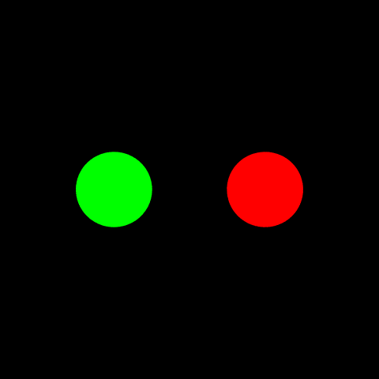 | 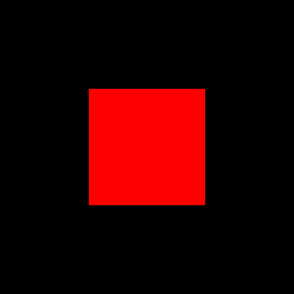 | 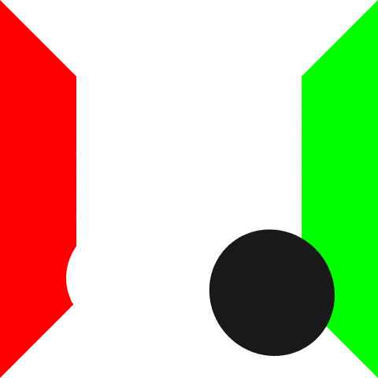 |

---

## 2. Éclairage et Ombres

### Modèle d'Illumination de Phong

J'ai implémenté le modèle local de Phong qui décompose la lumière en trois composantes :

1.  **Ambiante ($I_a$)** : Lumière constante.
2.  **Diffuse ($I_d$)** : Proportionnelle à $\cos(\theta) = N \cdot L$.
3.  **Spéculaire ($I_s$)** : Tache brillante proportionnelle à $(R \cdot V)^\alpha$.

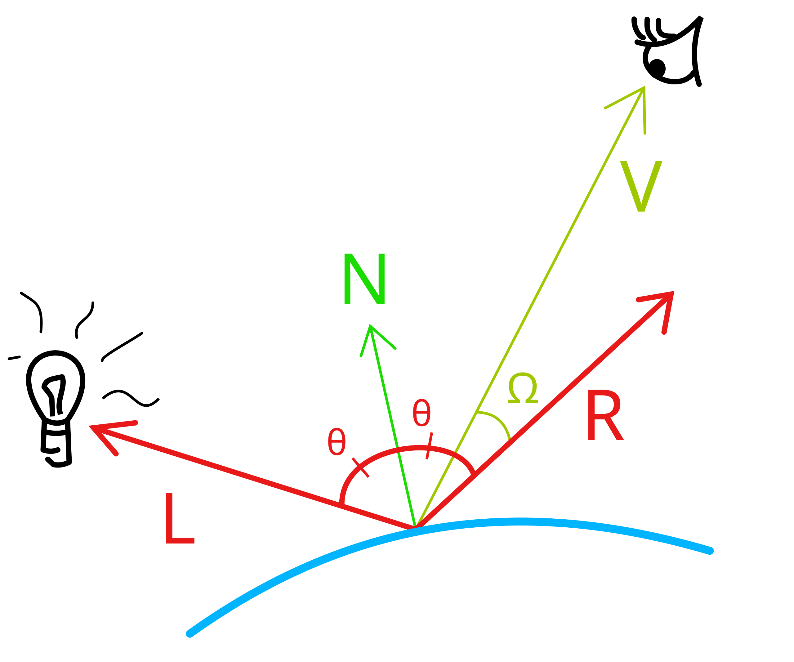

### Ombres Douces (Soft Shadows)

Pour pallier le manque de réalisme des ombres dures, j'ai implémenté des **Area Lights**.
L'algorithme repose sur une méthode de Monte-Carlo : je lance $N$ rayons (ex: 32) vers des points aléatoires répartis sur la surface de la lumière. Cela crée naturellement une zone de pénombre réaliste.

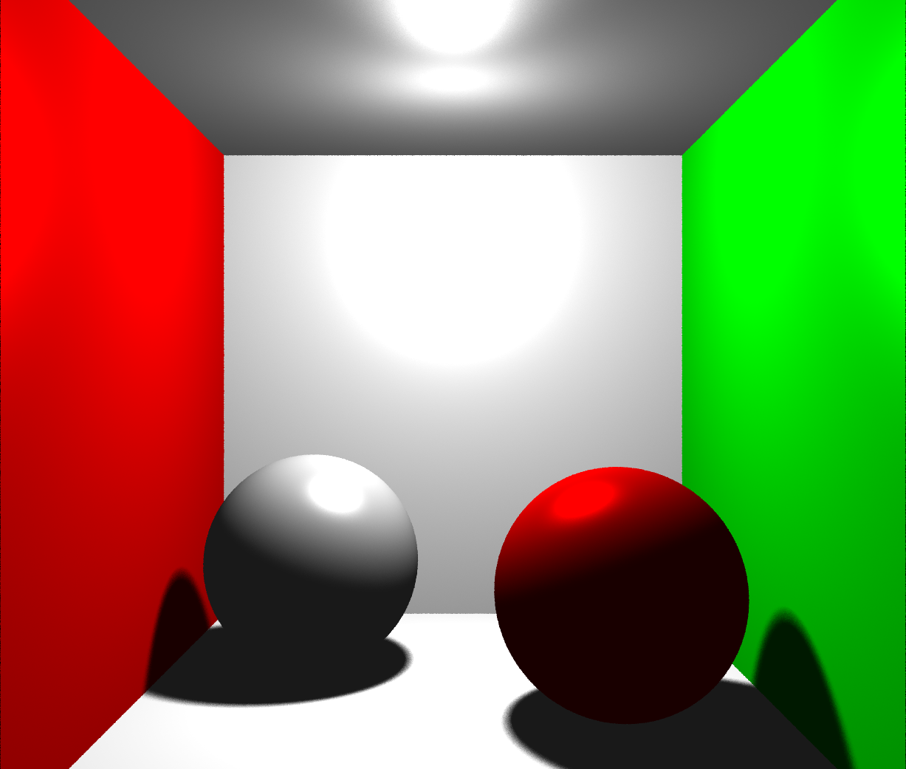
_Résultat : Sphères avec éclairage de Phong et ombres douces._

---

## 3. Géométrie Complexe et Réflexion

### Gestion des Maillages (.OFF)

Chargement de fichiers `.OFF` et stockage dans une classe `Mesh`.
J'ai implémenté le **Smooth Shading** : lors du chargement, je pré-calcule la normale moyenne de chaque sommet. Lors du rendu, j'interpole la normale via les coordonnées barycentriques :
$$N_{interpolée} = (1 - u - v) \cdot N_{v0} + u \cdot N_{v1} + v \cdot N_{v2}$$

### Intersection Möller–Trumbore

Pour l'intersection Rayon-Triangle, j'utilise l'algorithme de **Möller–Trumbore**. Il est rapide, économe en mémoire (pas de stockage de plan) et fournit directement les coordonnées barycentriques $(u, v)$ nécessaires au lissage des normales.

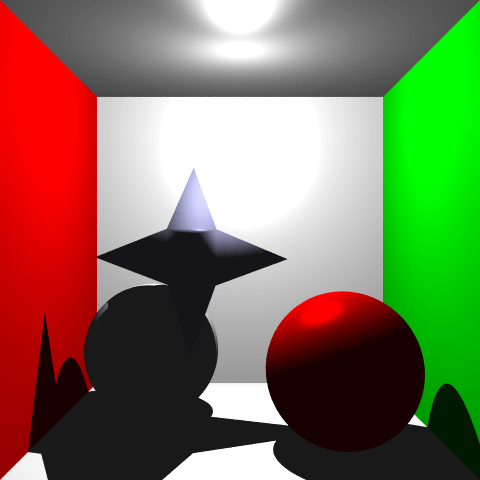

### Réflexion et Réfraction

J'ai introduit la récursivité pour gérer les matériaux complexes.

- **Réflexion (Miroir)** : Calcul du vecteur réfléchi $R = I - 2(N \cdot I)N$.
- **Réfraction (Verre/Eau)** : Utilisation de la loi de Snell-Descartes $n_1 \sin(\theta_1) = n_2 \sin(\theta_2)$.
  - Gestion entrée/sortie du milieu (inversion des normales et des indices).
  - Gestion de la réflexion totale interne.
- **Fresnel (Schlick)** : Approximation pour mixer réflexion et réfraction selon l'angle de vue (plus réflectif sur les bords).

|             Réfraction Standard             |           Effet Fresnel / Rasant            |
| :-----------------------------------------: | :-----------------------------------------: |
| 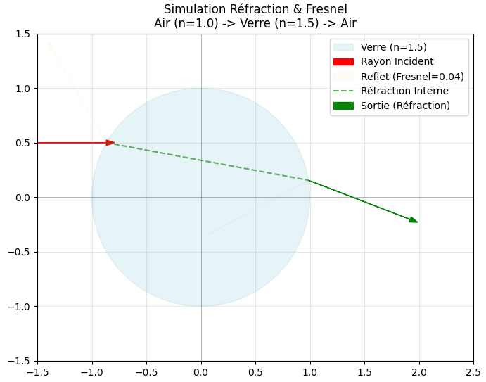 | 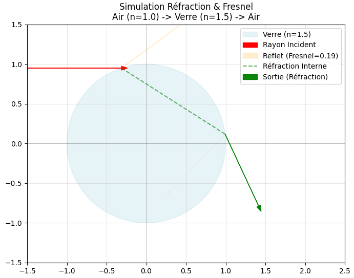 |
|             _Le rayon traverse_             |           _Le rayon est réfléchi_           |

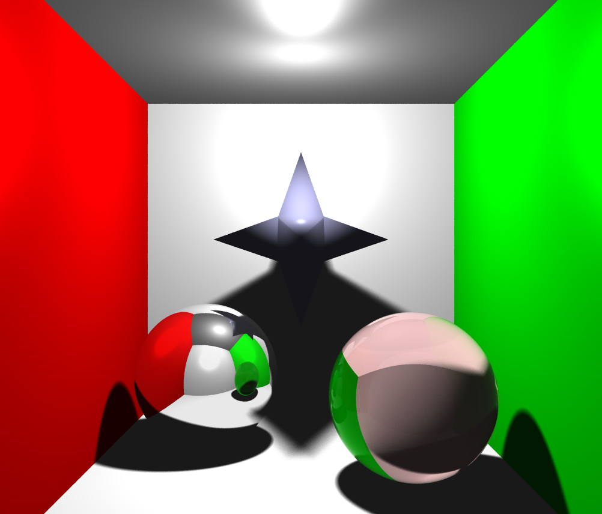

---

## 4. Structure d'Accélération (KdTree)

Pour optimiser le rendu des maillages complexes, j'ai implémenté un **KdTree à deux niveaux** (Architecture BVH).

### Architecture

1.  **Niveau 1 (Global / TLAS)** : Structure la scène. Il contient les **Objets** (Sphères, Meshs, Plans). Permet un _Culling_ efficace.
2.  **Niveau 2 (Local / BLAS)** : Interne au `Mesh`. Gère les milliers de triangles d'un objet. Utilise une traversée optimisée par pile itérative ($O(\log N)$).

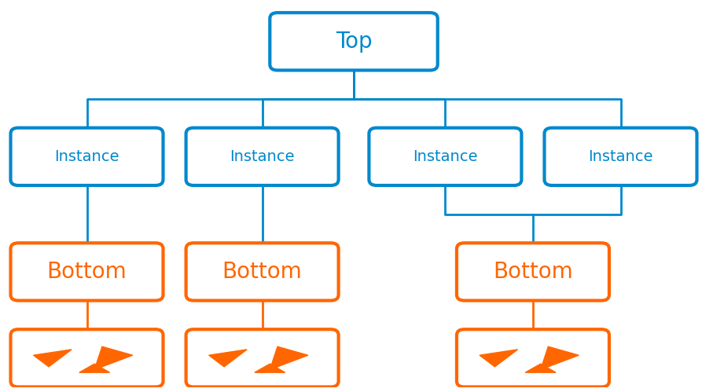

### Justification

Cette architecture sépare la logique de la scène de la géométrie pure. Elle correspond au standard industriel utilisé par les GPU modernes (RTX) sous les noms de **TLAS** (Top-Level Acceleration Structure) et **BLAS** (Bottom-Level Acceleration Structure).

|             KdTree Simple (1 niveau)             |            KdTree Complexe (2 niveaux)             |
| :----------------------------------------------: | :------------------------------------------------: |
|  |  |

_Références : [ARM Developer](https://learn.arm.com/learning-paths/mobile-graphics-and-gaming/ray_tracing/rt04_acceleration_structure/) | [Vulkan Tutorial](https://github.khronos.org/Vulkan-Site/tutorial/latest/courses/18_Ray_tracing/02_Acceleration_structures.html)_

---

## 5. Améliorations Visuelles

### Blinn-Phong

Remplacement de Phong par **Blinn-Phong** (utilisation du Half-Vector $H$). La différence est subtile mais physiquement plus plausible sur les spéculaires.

|                Phong Classique                 |                     Blinn-Phong                     |
| :--------------------------------------------: | :-------------------------------------------------: |
| 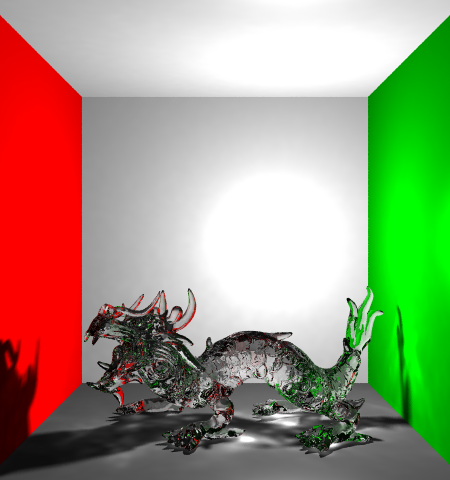 | 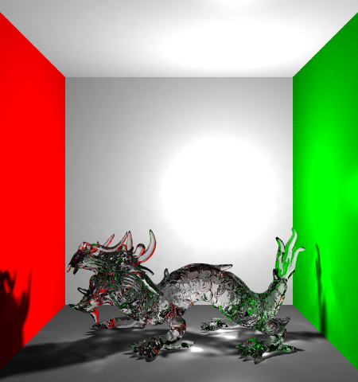 |

### Photon Mapping et Caustiques

Implémentation d'une passe de **Lancer de Photons** pour générer des caustiques (lumière focalisée par le verre).

1.  Émission de millions de photons depuis la lumière.
2.  Stockage dans une **Photon Map** (via un KdTree spécifique).
3.  Estimation de densité lors du rendu final (k-NN).

|                         Sans Photons                         |                           Avec 1M Photons                           |                          Debug PhotonMap                          |
| :----------------------------------------------------------: | :-----------------------------------------------------------------: | :---------------------------------------------------------------: |
| 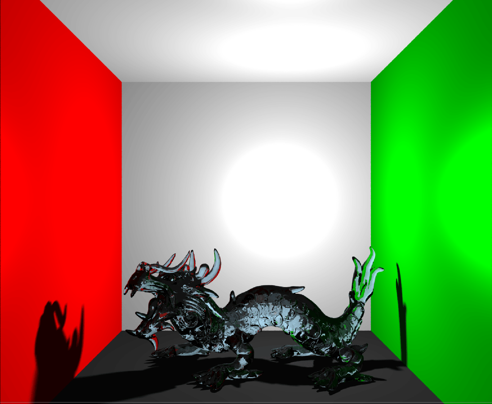 | 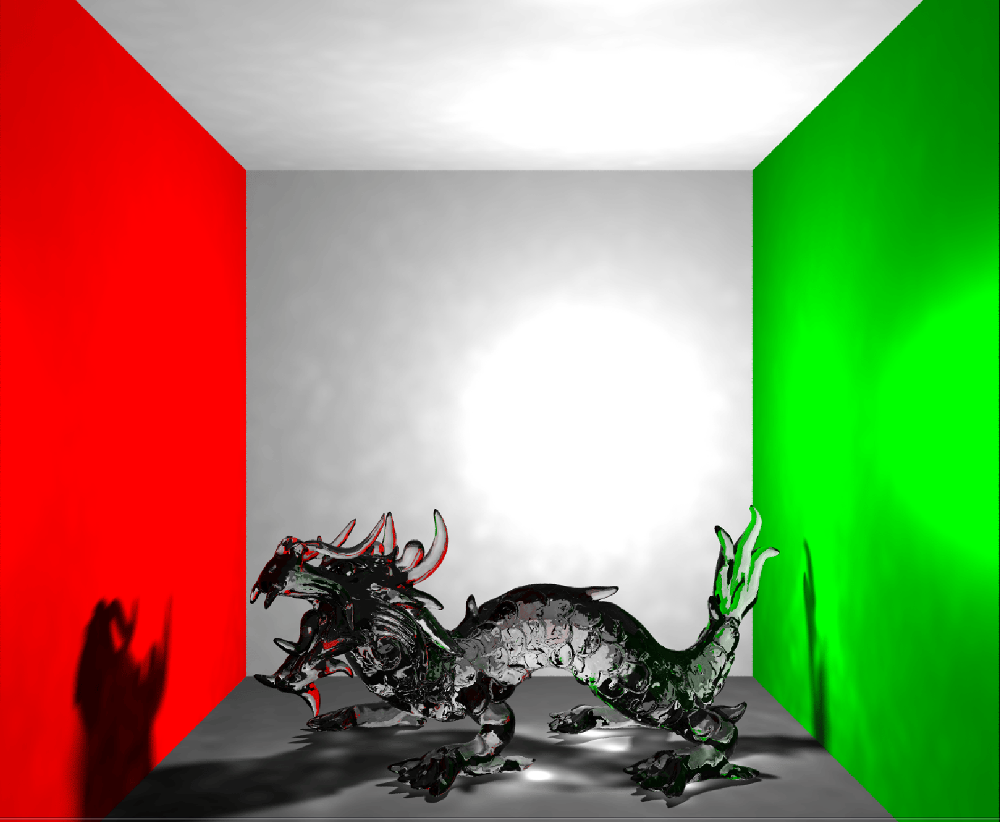 | 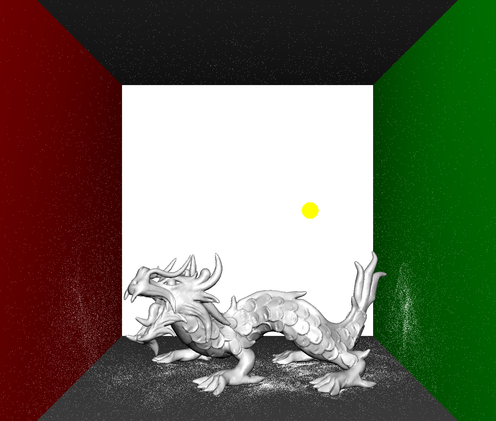 |
|                       _Ombres noires_                        |                        _Caustiques visibles_                        |                         _Nuage de points_                         |

_Références : [Alchetron](https://alchetron.com/Photon-mapping) | [Wikipédia](https://en.wikipedia.org/wiki/Photon_mapping)_

### Scène Sous-Marine

Création d'une eau procédurale (fonctions sinusoïdales) et simulation de l'absorption de la lumière (Brouillard/Beer-Lambert).

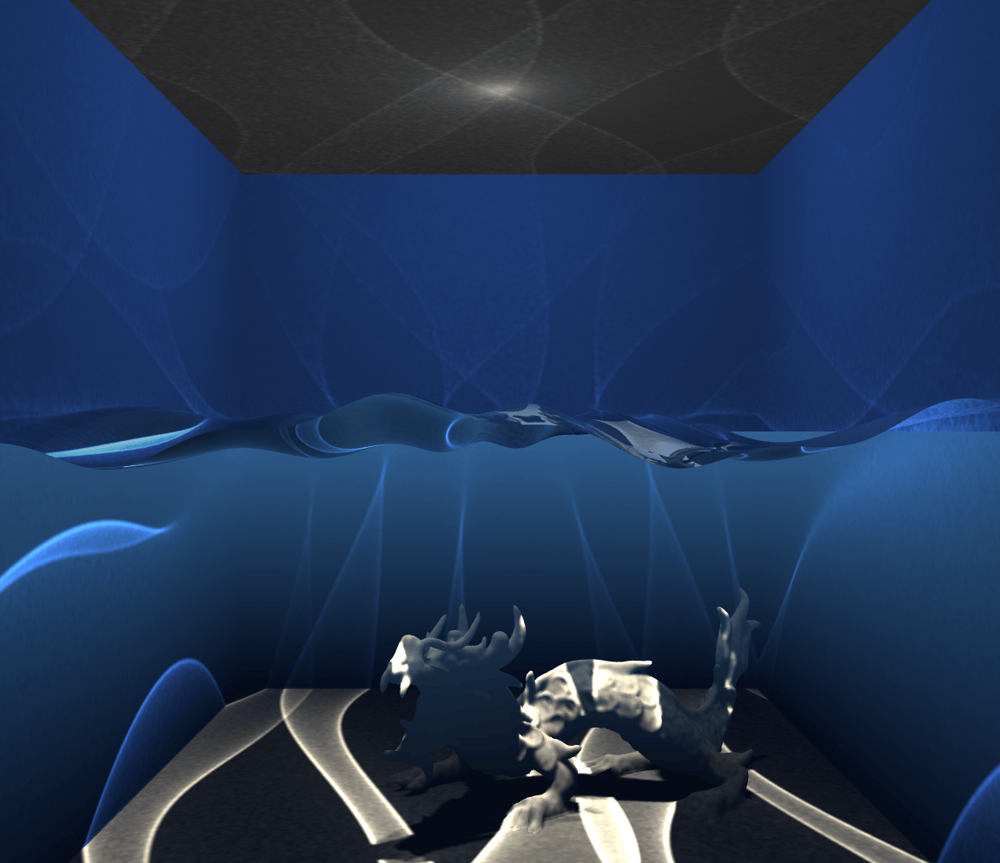

### Tone Mapping ACES

Application d'une courbe de Tone Mapping pour gérer la plage dynamique (HDR) et éviter la saturation des blancs ("clamping") due aux caustiques intenses.

|                       Sans Tone Mapping                        |                           Avec ACES                           |
| :------------------------------------------------------------: | :-----------------------------------------------------------: |
| 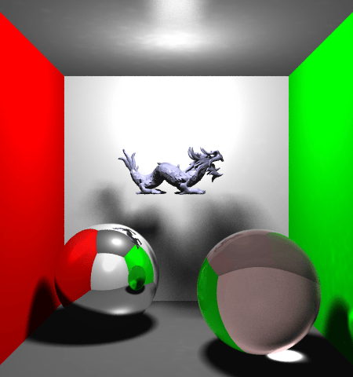 | 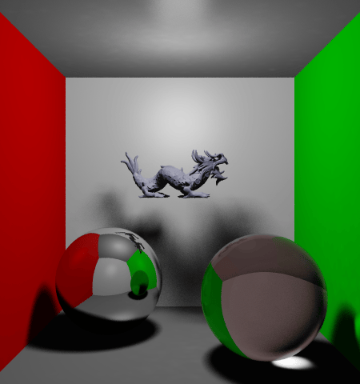 |
|                      _Saturation brutale_                      |                      _Détails préservés_                      |

---

## 6. Interface Utilisateur (ImGui)

Intégration d'une interface graphique pour le contrôle temps réel :

- Choix de scène.
- Position de la lumière / Puissance.
- Paramètres de rendu (Samples, Nb Photons).
- Debug (Visualisation KdTree, Photons).

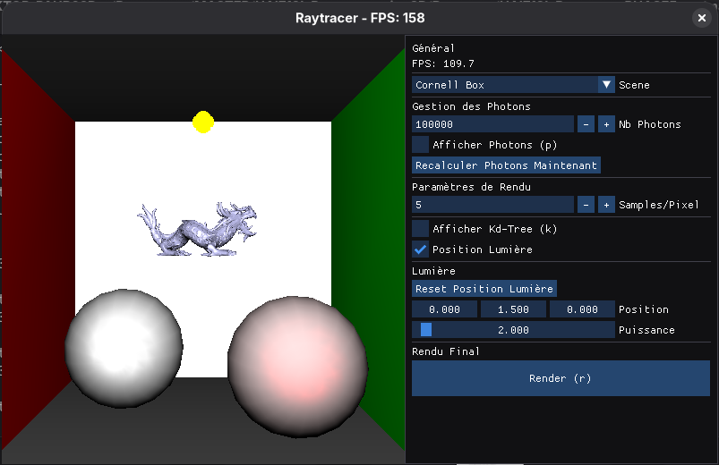

---

## 7. Rendu "Artistique"

### Fails & Bugs

Voici quelques "accidents" rencontrés durant le développement.

|                 "Varicelle" (Photons trop gros)                  |                     Miroir infini                     |                          Création de l'eau                           |
| :--------------------------------------------------------------: | :---------------------------------------------------: | :------------------------------------------------------------------: |
|  | 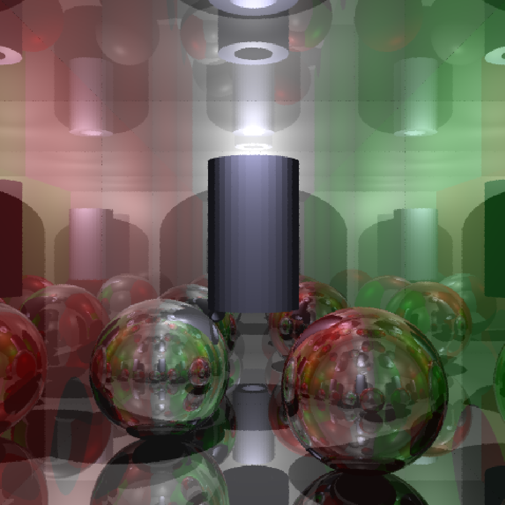 | 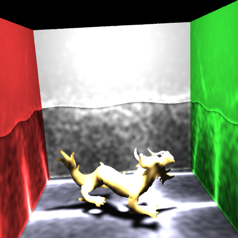 |

### Rendus Finaux

|                               Cornell Box (1M Photons)                                |                           Scène Sous-Marine (100M Photons)                            |
| :-----------------------------------------------------------------------------------: | :-----------------------------------------------------------------------------------: |
| 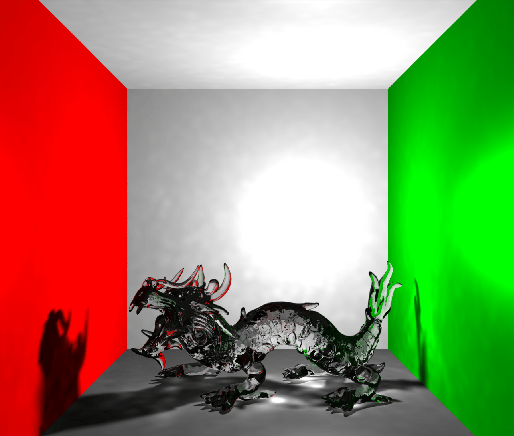 | 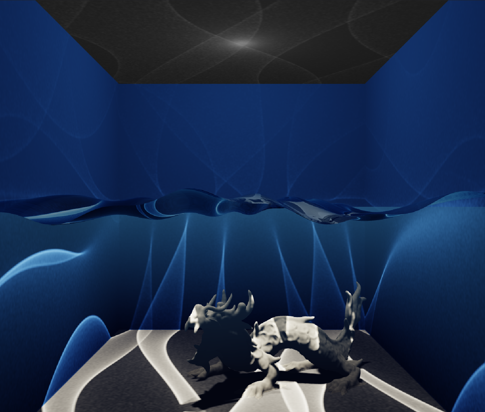 |

**Rendu Haute Qualité**
_10 millions de photons / 20 samples / HD / 389 secondes_

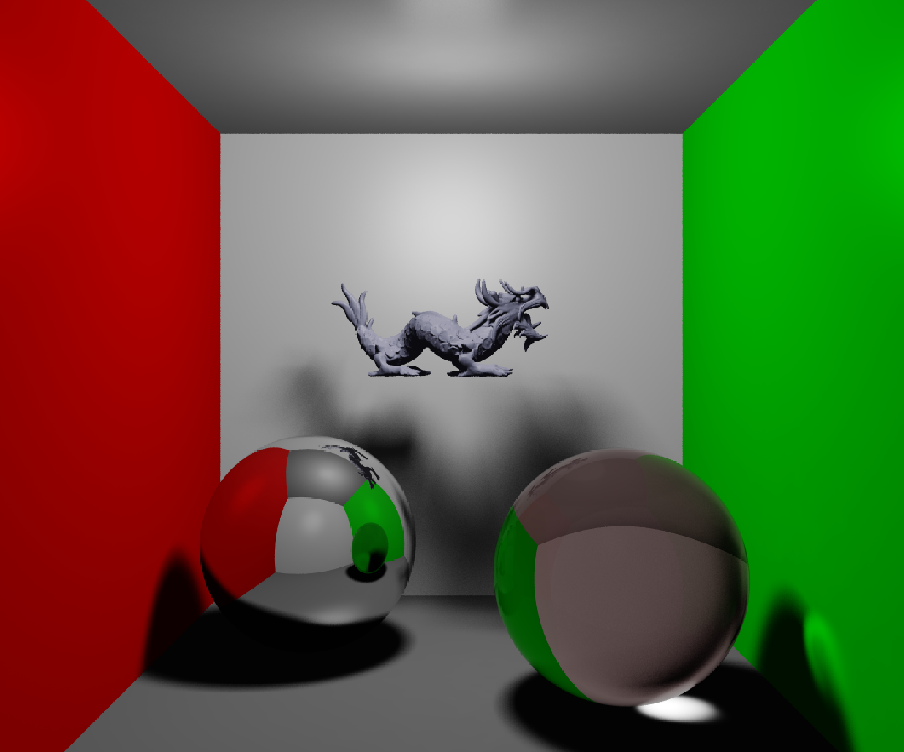
